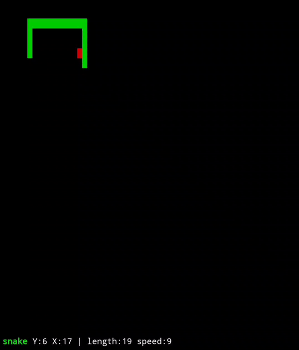

<div align="center">
<h1>snake</h1>
<p>A super minimal TUI snake game written in pure BASH v5.1+</p>


<br>
<br>

</div>

## Install
To try it out without installing anything

```sh
$ bash <(curl -s https://raw.githubusercontent.com/wick3dr0se/snake/main/snake.sh)
```

To install it to your machine run

```ocaml
$ git clone https://github.com/wick3dr0se/snake && cd ${_##*/}
$ sudo make install
```

## Usage
```bash
# if installed to path.
$ snake
# if it's not installed to path.
$ bash snake
```

## Controls
arrow keys, or:

H - move left  
J - move down  
K - move up  
L - move right

R - restart  
Q - quit

any other key pauses
